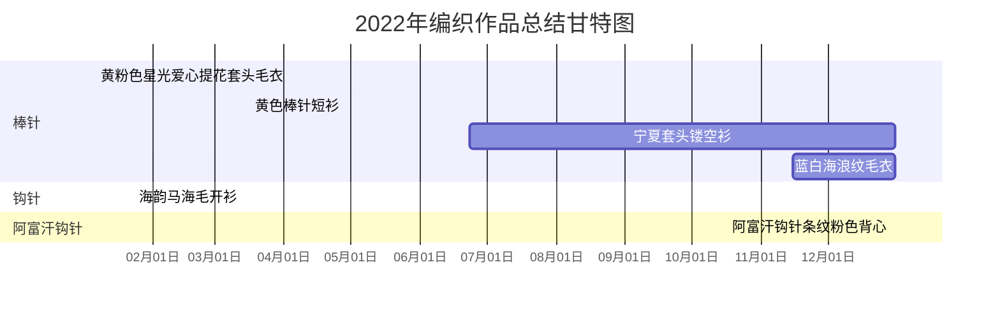

| 编号 | 名称 | 工具 | 类别 | 来源 | 开工 | 完工 | 用时 |
|------|-----|------|-----|------|------|-----|------|
| 1 | 黄粉色星光爱心提花套头毛衣 | 棒针| 童衣| 自己捣鼓| 2022-01-06 | 2022-05-08 | 4个月 |
| 2 | 海韵马海毛开衫| 钩针| 成衣| 苏苏姐家 | 2022-01-23 | 2022-11-15 | 9个月 |
| 3 | 黄色棒针短衫 | 棒针| 成衣| 编织书图解| 2022-03-16 | 2022-06-21 | 3个月 |
| 4 | 宁夏套头镂空衫 | 棒针| 成衣| 九色鹿淘宝店图解| 2022-06-23 | - | 未完工 |
| 5 | 阿富汗钩针条纹粉色背心| 阿富汗钩针| 童衣| 编织书图解胡乱捣鼓| 2022-10-16 | 2022-10-30 | 半个月 |
| 6 | 蓝白海浪纹毛衣 | 棒针| 童衣| 苏苏姐家| 2022-11-15 | - | 未完工 |

